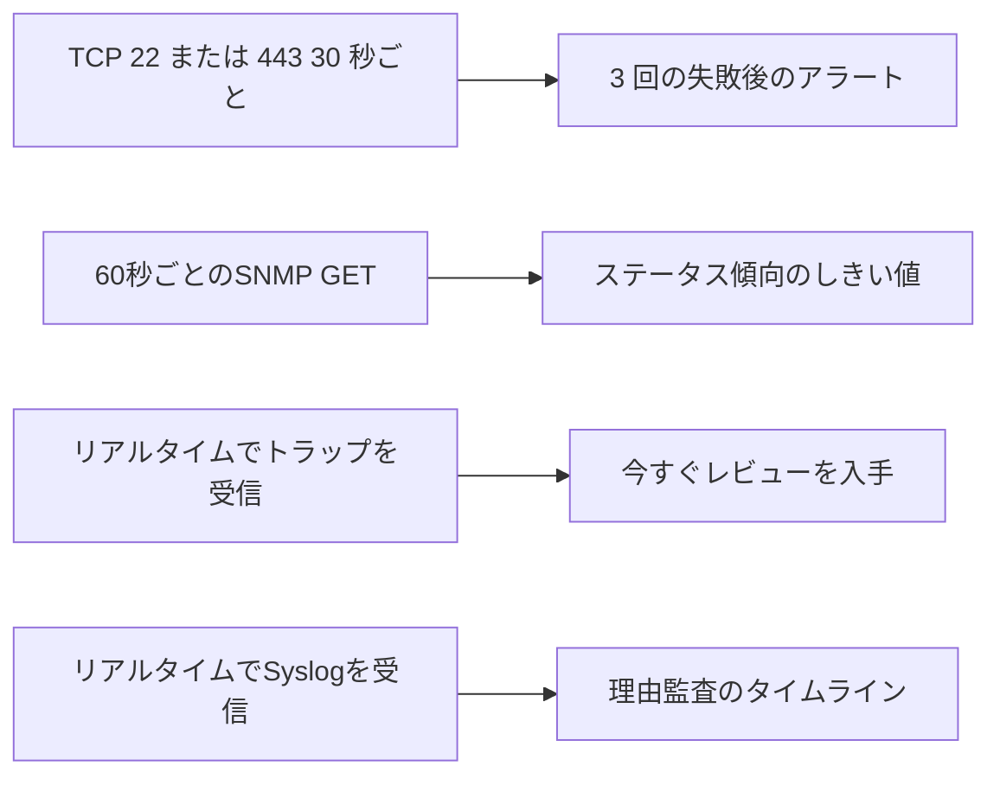

# スイッチ監視ポリシーの例

4 つのメソッドを実行可能な収集、レビュー、および警告の責任に実装します。

## 重要ポイント

- サンプル期間は開始点であり、すべてのデバイスに適用される固定標準ではありません。
- 3 回連続して TCP 障害が発生すると、瞬間的なパケット損失によって引き起こされるジッター アラートを減らすことができます。
- GET は、CPU、メモリ、実行時間、インターフェイス、エラー パケット、温度、ファン、電源を収集できます。
- トラップと Syslog はリアルタイムで受信され、レビューと関連付けのプロセスに入力されます。

---

## 章末クイズ

この章には5問の四択問題があります。

### 第 1 問

この章の例における TCP 検出期間はどれくらいですか?

- A. 1秒ごとにすべてのポートをチェックします
- B. 30 秒ごとに TCP 22 または 443 をチェックします
- C. 24時間ごとに確認する
- D. 手動操作時のみチェック

回答を選んだ後に解答を開く

正解：B. 30 秒ごとに TCP 22 または 443 をチェックします

解説：30 秒は、この章でポリシーを説明するために使用される値の例であり、すべての環境に固定された標準ではありません。

### 第 2 問

スイッチ監視の適切な責任分担は何ですか?

- A. TCP は温度を読み取り、GET はログを送信し、Trap はトレンドを描画し、Syslog は接続を確立します。
- B. 4 つのメソッドは同じブール値のみを記録します
- C. トラップのみを保持し、残りは無効にします
- D. TCP は管理の到達可能性をチェックし、GET はインジケータを収集し、トラップはレビューをトリガーし、Syslog は理由を追加します。

回答を選んだ後に解答を開く

正解：D. TCP は管理の到達可能性をチェックし、GET はインジケータを収集し、トラップはレビューをトリガーし、Syslog は理由を追加します。

解説：それぞれのタイプの手段は、そのデータと適時性の特性に応じた責任を負います。

### 第 3 問

3 回連続して TCP 障害が発生した場合にアラートを出す主な目的は何ですか?

- A. 瞬間的なパケット損失やジッターによって引き起こされる誤報を削減します。
- B. 機器がダウンしないようにする
- C. 代替リカバリ検出
- D. 根本原因を自動的に特定

回答を選んだ後に解答を開く

正解：A. 瞬間的なパケット損失やジッターによって引き起こされる誤報を削減します。

解説：継続的障害戦略では短期的な変動を抑えることができますが、それでもプロセスを記録し、復旧時に確認する必要があります。

### 第 4 問

デバイスの数が10倍になった場合、何を優先すべきでしょうか?

- A. すべてのサイクルを直接 10 倍短縮します
- B. タイムアウト制限をキャンセルする
- C. 同時実行性、オフピーク、キュー、ネットワーク、ストレージ容量を評価します
- D. デバイスの処理能力を無視する

回答を選んだ後に解答を開く

正解：C. 同時実行性、オフピーク、キュー、ネットワーク、ストレージ容量を評価します

解説：規模が拡大すると、ポーリングと受信の負荷が増加します。これは、容量テストとスケジューリング設計を通じて検証する必要があります。

### 第 5 問

30 秒と 60 秒という 2 つの期間の例をどのように理解できますか?

- A. これらはすべての生産設備に必須の規格です
- B. これらは設計の開始点であり、実際の値はリスクと容量に合わせて調整する必要があります
- C. これらの値が使用されている限り、ストレス テストは必要ありません。
- D. サイクルタイムはデバイスの数とは関係ありません

回答を選んだ後に解答を開く

正解：B. これらは設計の開始点であり、実際の値はリスクと容量に合わせて調整する必要があります

解説：ポーリング戦略は、デバイスのサイズ、重要性、およびプラットフォームの処理能力に適応させる必要があります。

<!-- QUIZ_DATA_START
{
  "chapter": "24",
  "questions": [
    {
      "id": 1,
      "question": "この章の例における TCP 検出期間はどれくらいですか?",
      "options": {
        "A": "1秒ごとにすべてのポートをチェックします",
        "B": "30 秒ごとに TCP 22 または 443 をチェックします",
        "C": "24時間ごとに確認する",
        "D": "手動操作時のみチェック"
      },
      "answer": "B",
      "explanation": "30 秒は、この章でポリシーを説明するために使用される値の例であり、すべての環境に固定された標準ではありません。"
    },
    {
      "id": 2,
      "question": "スイッチ監視の適切な責任分担は何ですか?",
      "options": {
        "A": "TCP は温度を読み取り、GET はログを送信し、Trap はトレンドを描画し、Syslog は接続を確立します。",
        "B": "4 つのメソッドは同じブール値のみを記録します",
        "C": "トラップのみを保持し、残りは無効にします",
        "D": "TCP は管理の到達可能性をチェックし、GET はインジケータを収集し、トラップはレビューをトリガーし、Syslog は理由を追加します。"
      },
      "answer": "D",
      "explanation": "それぞれのタイプの手段は、そのデータと適時性の特性に応じた責任を負います。"
    },
    {
      "id": 3,
      "question": "3 回連続して TCP 障害が発生した場合にアラートを出す主な目的は何ですか?",
      "options": {
        "A": "瞬間的なパケット損失やジッターによって引き起こされる誤報を削減します。",
        "B": "機器がダウンしないようにする",
        "C": "代替リカバリ検出",
        "D": "根本原因を自動的に特定"
      },
      "answer": "A",
      "explanation": "継続的障害戦略では短期的な変動を抑えることができますが、それでもプロセスを記録し、復旧時に確認する必要があります。"
    },
    {
      "id": 4,
      "question": "デバイスの数が10倍になった場合、何を優先すべきでしょうか?",
      "options": {
        "A": "すべてのサイクルを直接 10 倍短縮します",
        "B": "タイムアウト制限をキャンセルする",
        "C": "同時実行性、オフピーク、キュー、ネットワーク、ストレージ容量を評価します",
        "D": "デバイスの処理能力を無視する"
      },
      "answer": "C",
      "explanation": "規模が拡大すると、ポーリングと受信の負荷が増加します。これは、容量テストとスケジューリング設計を通じて検証する必要があります。"
    },
    {
      "id": 5,
      "question": "30 秒と 60 秒という 2 つの期間の例をどのように理解できますか?",
      "options": {
        "A": "これらはすべての生産設備に必須の規格です",
        "B": "これらは設計の開始点であり、実際の値はリスクと容量に合わせて調整する必要があります",
        "C": "これらの値が使用されている限り、ストレス テストは必要ありません。",
        "D": "サイクルタイムはデバイスの数とは関係ありません"
      },
      "answer": "B",
      "explanation": "ポーリング戦略は、デバイスのサイズ、重要性、およびプラットフォームの処理能力に適応させる必要があります。"
    }
  ]
}
QUIZ_DATA_END -->
