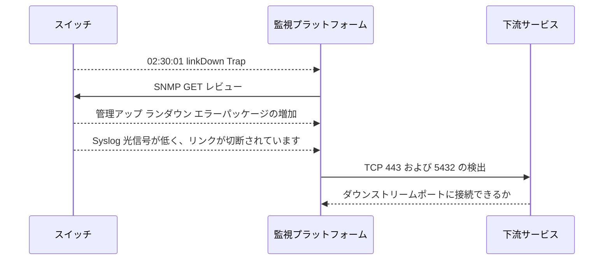

# 完全な障害分析: 発見から限界まで

アップリンク ポートの障害を例に、4 種類の証拠を時系列につなぎ合わせます。

## 重要ポイント

- トラップは最初にアップリンク インターフェイス linkDown を通知します。
- GET は、インターフェイスが管理者によって閉じられていないが、実際には切断されており、エラー パケットが含まれていることを証明します。
- Syslog は、光信号が弱くなってから回線プロトコルが切断されるまでのタイムラインを示します。
- TCP は、スイッチ管理プレーンがまだオンラインであるが、ダウンストリーム サービス ポートに到達できないことを証明します。

---

## 章末クイズ

この章には5問の四択問題があります。

### 第 1 問

完全なケースで上位リンクの変化を迅速に検出する最初の信号は何ですか?

- A. 日次容量レポート
- B. リンクダウントラップ
- C. Webページのスクリーンショット
- D. データベースのバックアップ

回答を選んだ後に解答を開く

正解：B. リンクダウントラップ

解説：トラップは 02:30:01 にインターフェイスの変更を報告し、その後のレビューを開始します。

### 第 2 問

発見から境界設定までの正しい順序は何ですか?

- A. TCP が根本原因を説明し、ログが OID を読み取り、GET がトラップを送信します
- B. 最初に復元してから検出します
- C. 単一のポートのみを確認し、イベントを直接閉じます。
- D. トラップ検出、GET 確認、Syslog 解釈、TCP 検証の影響

回答を選んだ後に解答を開く

正解：D. トラップ検出、GET 確認、Syslog 解釈、TCP 検証の影響

解説：変化、状況、原因、影響範囲を4つのステップで回答します。

### 第 3 問

GET は管理の稼働中、稼働中、エラー パケットの増加を返します。最も合理的な意味は何ですか?

- A. インターフェースは管理者によって閉じられていませんが、実際には切断されており、障害が発生する前にリンク異常が発生している可能性があります。
- B. インターフェイスはダウンしており、適切に機能するように構成されています
- C. スイッチ全体の電源をオフにする必要があります
- D. Syslog 時間が間違っているはずです

回答を選んだ後に解答を開く

正解：A. インターフェースは管理者によって閉じられていませんが、実際には切断されており、障害が発生する前にリンク異常が発生している可能性があります。

解説：管理および運用ステータスは、構成の意図と実際のリンクを区別し、エラー パケットは障害が発生する前の異常を示す手がかりを提供します。

### 第 4 問

Syslog で光信号が低下すると、インターフェイスが切断されます。根本原因をどのように説明すべきでしょうか?

- A. たった 1 つのログですべてのハードウェアの根本原因を確実に証明できます
- B. このタイムラインは無視すべきです
- C. これは原因の強力な手がかりですが、光パワー、モジュール、またはオンサイト検査によって確認する必要があります。
- D. データベースポートの障害を示します

回答を選んだ後に解答を開く

正解：C. これは原因の強力な手がかりですが、光パワー、モジュール、またはオンサイト検査によって確認する必要があります。

解説：ログは合理的な推測を裏付けますが、物理的な根本原因は、対応する測定と検査を通じて検証する必要があります。

### 第 5 問

スイッチ管理ポートは稼働していますが、ダウンストリーム 443 と 5432 で障害が発生しています。どちらの結論がより正確ですか?

- A. スイッチ全体の電源がオフになっています
- B. スイッチはまだオンラインですが、アップリンク障害はダウンストリーム サービス パスに影響を与えます。
- C. すべての下流アプリケーションは正常です
- D. TCP検出により光モジュールモデルが証明されました

回答を選んだ後に解答を開く

正解：B. スイッチはまだオンラインですが、アップリンク障害はダウンストリーム サービス パスに影響を与えます。

解説：管理プレーンが正常なら装置全体の停止という可能性を一つ除外でき、下流側の失敗から業務への影響範囲を確認できます。

<!-- QUIZ_DATA_START
{
  "chapter": "25",
  "questions": [
    {
      "id": 1,
      "question": "完全なケースで上位リンクの変化を迅速に検出する最初の信号は何ですか?",
      "options": {
        "A": "日次容量レポート",
        "B": "リンクダウントラップ",
        "C": "Webページのスクリーンショット",
        "D": "データベースのバックアップ"
      },
      "answer": "B",
      "explanation": "トラップは 02:30:01 にインターフェイスの変更を報告し、その後のレビューを開始します。"
    },
    {
      "id": 2,
      "question": "発見から境界設定までの正しい順序は何ですか?",
      "options": {
        "A": "TCP が根本原因を説明し、ログが OID を読み取り、GET がトラップを送信します",
        "B": "最初に復元してから検出します",
        "C": "単一のポートのみを確認し、イベントを直接閉じます。",
        "D": "トラップ検出、GET 確認、Syslog 解釈、TCP 検証の影響"
      },
      "answer": "D",
      "explanation": "変化、状況、原因、影響範囲を4つのステップで回答します。"
    },
    {
      "id": 3,
      "question": "GET は管理の稼働中、稼働中、エラー パケットの増加を返します。最も合理的な意味は何ですか?",
      "options": {
        "A": "インターフェースは管理者によって閉じられていませんが、実際には切断されており、障害が発生する前にリンク異常が発生している可能性があります。",
        "B": "インターフェイスはダウンしており、適切に機能するように構成されています",
        "C": "スイッチ全体の電源をオフにする必要があります",
        "D": "Syslog 時間が間違っているはずです"
      },
      "answer": "A",
      "explanation": "管理および運用ステータスは、構成の意図と実際のリンクを区別し、エラー パケットは障害が発生する前の異常を示す手がかりを提供します。"
    },
    {
      "id": 4,
      "question": "Syslog で光信号が低下すると、インターフェイスが切断されます。根本原因をどのように説明すべきでしょうか?",
      "options": {
        "A": "たった 1 つのログですべてのハードウェアの根本原因を確実に証明できます",
        "B": "このタイムラインは無視すべきです",
        "C": "これは原因の強力な手がかりですが、光パワー、モジュール、またはオンサイト検査によって確認する必要があります。",
        "D": "データベースポートの障害を示します"
      },
      "answer": "C",
      "explanation": "ログは合理的な推測を裏付けますが、物理的な根本原因は、対応する測定と検査を通じて検証する必要があります。"
    },
    {
      "id": 5,
      "question": "スイッチ管理ポートは稼働していますが、ダウンストリーム 443 と 5432 で障害が発生しています。どちらの結論がより正確ですか?",
      "options": {
        "A": "スイッチ全体の電源がオフになっています",
        "B": "スイッチはまだオンラインですが、アップリンク障害はダウンストリーム サービス パスに影響を与えます。",
        "C": "すべての下流アプリケーションは正常です",
        "D": "TCP検出により光モジュールモデルが証明されました"
      },
      "answer": "B",
      "explanation": "管理プレーンが正常なら装置全体の停止という可能性を一つ除外でき、下流側の失敗から業務への影響範囲を確認できます。"
    }
  ]
}
QUIZ_DATA_END -->
