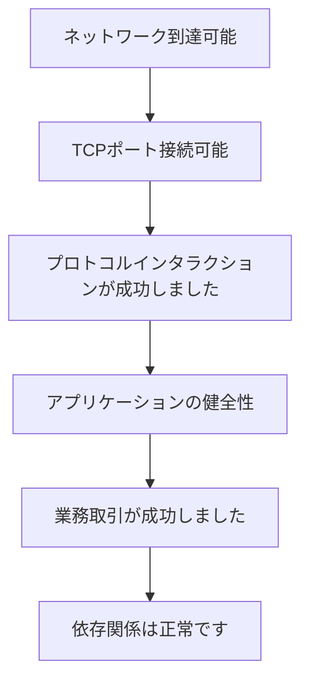

# 階層化されたヘルスチェック

ポートの成功は正常なリンクの 1 つの層にすぎず、プロトコル、アプリケーション、およびサービスの検証に代わるものではありません。

## 重要ポイント

- TCP の成功は、HTTP またはその他のアプリケーション プロトコルの成功と同じではありません。
- プロトコルの成功は、アプリケーションの内部健全性と同等ではありません。
- アプリケーションの正常性は、エンドツーエンドの業務 トランザクションの成功と同等ではありません。
- 各レイヤーは、そのレイヤーのセマンティクスと一致する検査およびアラート コピーを使用する必要があります。

---

## 章末クイズ

この章には5問の四択問題があります。

### 第 1 問

階層化されたヘルスチェックでは、TCP ポートが接続可能になった後にどの層が続きますか?

- A. 通常はすべての依存関係に直接ジャンプします
- B. プロトコルインタラクションが成功しました
- C. ログの保持のみを確認する
- D. MIBを再構築する

回答を選んだ後に解答を開く

正解：B. プロトコルインタラクションが成功しました

解説：TCP 層の後は、TLS、HTTP、またはその他のアプリケーション プロトコルの相互作用を検証する必要があります。

### 第 2 問

下から企業への検査の合理的な順序は何ですか?

- A. 業務、ログ、MIB、ポート
- B. TCP層のみをチェックする
- C. 最初に依存してから、ネットワークが正常であると想定します
- D. ネットワーク、TCP、プロトコル、アプリケーション、業務トランザクション、依存関係

回答を選んだ後に解答を開く

正解：D. ネットワーク、TCP、プロトコル、アプリケーション、業務トランザクション、依存関係

解説：レイヤーごとの検査により、障害の境界が明確になり、結論が拡大することを回避できます。

### 第 3 問

アラートのコピーライティングの各層の基本要件は何ですか?

- A. この層で実際に検証された事実のみを記述します
- B. 常に最も真剣な言葉を使用する
- C. Write timeout as data loss
- D. ソース、ターゲット、時間を省略

回答を選んだ後に解答を開く

正解：A. この層で実際に検証された事実のみを記述します

解説：アラートは証拠のセマンティクスと一致する必要があります。たとえば、業務全体がダウンしているため、TCP タイムアウトを直接書き込むことはできません。

### 第 4 問

ヘルスインターフェイスは成功しますが、実際の注文は失敗します。次に何を確認すればよいでしょうか?

- A. ICMP Pingのみを繰り返す
- B. ユーザーの操作エラーを判断する
- C. 業務 トランザクション パスとデータベース、キュー、その他の依存関係
- D. すべてのログを削除する

回答を選んだ後に解答を開く

正解：C. 業務 トランザクション パスとデータベース、キュー、その他の依存関係

解説：アプリケーション正常性エンドポイントは必ずしも完全な業務 プロセスをカバーしているわけではなく、エンドツーエンドのトランザクション レベルの検証を実行する必要があります。

### 第 5 問

どの方程式が間違っていますか?

- A. ネットワーク到達可能性は、ポートが開いていることを保証するものではありません
- B. TCP の成功は、業務とすべての依存関係が正常であることを意味します
- C. 契約の成功は業務の成功を保証するものではありません
- D. レイヤーが異なれば、異なる検出が必要になります

回答を選んだ後に解答を開く

正解：B. TCP の成功は、業務とすべての依存関係が正常であることを意味します

解説：TCP は接続層のみを検証し、アプリケーション、業務、および依存関係のチェックを置き換えることはできません。

<!-- QUIZ_DATA_START
{
  "chapter": "26",
  "questions": [
    {
      "id": 1,
      "question": "階層化されたヘルスチェックでは、TCP ポートが接続可能になった後にどの層が続きますか?",
      "options": {
        "A": "通常はすべての依存関係に直接ジャンプします",
        "B": "プロトコルインタラクションが成功しました",
        "C": "ログの保持のみを確認する",
        "D": "MIBを再構築する"
      },
      "answer": "B",
      "explanation": "TCP 層の後は、TLS、HTTP、またはその他のアプリケーション プロトコルの相互作用を検証する必要があります。"
    },
    {
      "id": 2,
      "question": "下から企業への検査の合理的な順序は何ですか?",
      "options": {
        "A": "業務、ログ、MIB、ポート",
        "B": "TCP層のみをチェックする",
        "C": "最初に依存してから、ネットワークが正常であると想定します",
        "D": "ネットワーク、TCP、プロトコル、アプリケーション、業務トランザクション、依存関係"
      },
      "answer": "D",
      "explanation": "レイヤーごとの検査により、障害の境界が明確になり、結論が拡大することを回避できます。"
    },
    {
      "id": 3,
      "question": "アラートのコピーライティングの各層の基本要件は何ですか?",
      "options": {
        "A": "この層で実際に検証された事実のみを記述します",
        "B": "常に最も真剣な言葉を使用する",
        "C": "Write timeout as data loss",
        "D": "ソース、ターゲット、時間を省略"
      },
      "answer": "A",
      "explanation": "アラートは証拠のセマンティクスと一致する必要があります。たとえば、業務全体がダウンしているため、TCP タイムアウトを直接書き込むことはできません。"
    },
    {
      "id": 4,
      "question": "ヘルスインターフェイスは成功しますが、実際の注文は失敗します。次に何を確認すればよいでしょうか?",
      "options": {
        "A": "ICMP Pingのみを繰り返す",
        "B": "ユーザーの操作エラーを判断する",
        "C": "業務 トランザクション パスとデータベース、キュー、その他の依存関係",
        "D": "すべてのログを削除する"
      },
      "answer": "C",
      "explanation": "アプリケーション正常性エンドポイントは必ずしも完全な業務 プロセスをカバーしているわけではなく、エンドツーエンドのトランザクション レベルの検証を実行する必要があります。"
    },
    {
      "id": 5,
      "question": "どの方程式が間違っていますか?",
      "options": {
        "A": "ネットワーク到達可能性は、ポートが開いていることを保証するものではありません",
        "B": "TCP の成功は、業務とすべての依存関係が正常であることを意味します",
        "C": "契約の成功は業務の成功を保証するものではありません",
        "D": "レイヤーが異なれば、異なる検出が必要になります"
      },
      "answer": "B",
      "explanation": "TCP は接続層のみを検証し、アプリケーション、業務、および依存関係のチェックを置き換えることはできません。"
    }
  ]
}
QUIZ_DATA_END -->
