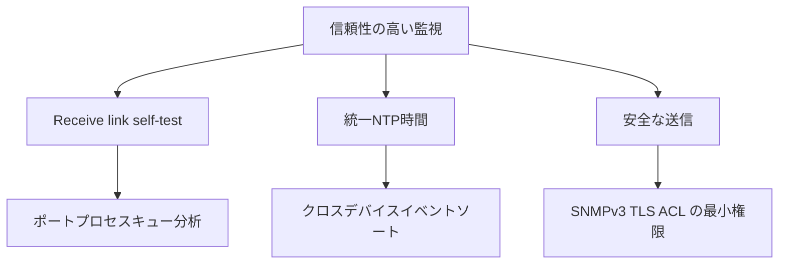

# リンク、タイミング、セキュリティの受信

信頼性の高い監視では、機器を監視するだけでなく、監視パイプライン自体も監視します。

## 重要ポイント

- トラップを定期的にテストし、受信プロセス、ポート、キュー、解析エラーを監視します。
- すべてのデバイスとプラットフォームは、一貫した信頼性の高い NTP タイム ソースを使用する必要があります。
- TLS 経由の Syslog を使用した実稼働ファーストの SNMPv3。
- また、監視元 IP を制限し、ACL、ファイアウォール ホワイトリスト、読み取り専用の最小限の権限を使用します。

---

## 章末クイズ

この章には5問の四択問題があります。

### 第 1 問

なぜトラップ受信リンク自体を監視するのでしょうか?

- A. 受信機はデバイスの温度を変更する責任があります
- B. 受信機に障害が発生すると、デバイスのイベントが効果的なアラートを形成できなくなります。
- C. Receiver can replace NTP
- D. 受取人は取引を保証します

回答を選んだ後に解答を開く

正解：B. 受信機に障害が発生すると、デバイスのイベントが効果的なアラートを形成できなくなります。

解説：ポート、プロセス、キュー、またはパーサーの障害により、監視の盲点が発生する可能性があります。

### 第 2 問

監視証拠の信頼性を高めるための合理的な組み合わせは何ですか?

- A. 時刻同期をオフにして、すべてのソースをオンにします
- B. アラートの色のみを変更する
- C. 資格情報を通常のログに書き込む
- D. リンクセルフテスト、統一時間、SNMPv3 または TLS、ACL、および最小権限

回答を選んだ後に解答を開く

正解：D. リンクセルフテスト、統一時間、SNMPv3 または TLS、ACL、および最小権限

解説：信頼性、時間の一貫性、およびセキュリティ制御によって、監視データが利用可能で信頼できるかどうかが判断されます。

### 第 3 問

統一 NTP 時間の主な役割は何ですか?

- A. クロスデバイス イベントを正しい順序で関連付けることができます。
- B. 自動暗号化SNMP
- C. TCPポートの数を増やす
- D. ベンダーMIBの生成

回答を選んだ後に解答を開く

正解：A. クロスデバイス イベントを正しい順序で関連付けることができます。

解説：クロック スキューは障害のタイムラインを歪める可能性があるため、タイム ソースを統合してスキューを監視する必要があります。

### 第 4 問

テスト トラップはプロセスに到達できますが、アラートはまだ見つかりません。次に何を確認する必要がありますか?

- A. モニターの明るさだけを確認する
- B. TCPサービスポートの変更
- C. キューのバックログ、解析の失敗、およびその後のイベント処理
- D. プラットフォームが完全に正常であると仮定します

回答を選んだ後に解答を開く

正解：C. キューのバックログ、解析の失敗、およびその後のイベント処理

解説：ポートとプロセスの活性度はリンクの一部のみをカバーし、解析、キューイング、相関、通知も検証します。

### 第 5 問

どのセキュリティ慣行が間違っていますか?

- A. SNMP アカウントには読み取り専用権限があります
- B. プロトコル セキュリティを有効にした後、監視側ポートを任意の送信元に対して開きます。
- C. Syslog に依存するリンク優先 TLS
- D. ACL を使用して監視ソースを制限する

回答を選んだ後に解答を開く

正解：B. プロトコル セキュリティを有効にした後、監視側ポートを任意の送信元に対して開きます。

解説：プロトコル保護はネットワーク アクセス制御に代わるものではないため、ポートは引き続き許可された送信元に制限する必要があります。

<!-- QUIZ_DATA_START
{
  "chapter": "27",
  "questions": [
    {
      "id": 1,
      "question": "なぜトラップ受信リンク自体を監視するのでしょうか?",
      "options": {
        "A": "受信機はデバイスの温度を変更する責任があります",
        "B": "受信機に障害が発生すると、デバイスのイベントが効果的なアラートを形成できなくなります。",
        "C": "Receiver can replace NTP",
        "D": "受取人は取引を保証します"
      },
      "answer": "B",
      "explanation": "ポート、プロセス、キュー、またはパーサーの障害により、監視の盲点が発生する可能性があります。"
    },
    {
      "id": 2,
      "question": "監視証拠の信頼性を高めるための合理的な組み合わせは何ですか?",
      "options": {
        "A": "時刻同期をオフにして、すべてのソースをオンにします",
        "B": "アラートの色のみを変更する",
        "C": "資格情報を通常のログに書き込む",
        "D": "リンクセルフテスト、統一時間、SNMPv3 または TLS、ACL、および最小権限"
      },
      "answer": "D",
      "explanation": "信頼性、時間の一貫性、およびセキュリティ制御によって、監視データが利用可能で信頼できるかどうかが判断されます。"
    },
    {
      "id": 3,
      "question": "統一 NTP 時間の主な役割は何ですか?",
      "options": {
        "A": "クロスデバイス イベントを正しい順序で関連付けることができます。",
        "B": "自動暗号化SNMP",
        "C": "TCPポートの数を増やす",
        "D": "ベンダーMIBの生成"
      },
      "answer": "A",
      "explanation": "クロック スキューは障害のタイムラインを歪める可能性があるため、タイム ソースを統合してスキューを監視する必要があります。"
    },
    {
      "id": 4,
      "question": "テスト トラップはプロセスに到達できますが、アラートはまだ見つかりません。次に何を確認する必要がありますか?",
      "options": {
        "A": "モニターの明るさだけを確認する",
        "B": "TCPサービスポートの変更",
        "C": "キューのバックログ、解析の失敗、およびその後のイベント処理",
        "D": "プラットフォームが完全に正常であると仮定します"
      },
      "answer": "C",
      "explanation": "ポートとプロセスの活性度はリンクの一部のみをカバーし、解析、キューイング、相関、通知も検証します。"
    },
    {
      "id": 5,
      "question": "どのセキュリティ慣行が間違っていますか?",
      "options": {
        "A": "SNMP アカウントには読み取り専用権限があります",
        "B": "プロトコル セキュリティを有効にした後、監視側ポートを任意の送信元に対して開きます。",
        "C": "Syslog に依存するリンク優先 TLS",
        "D": "ACL を使用して監視ソースを制限する"
      },
      "answer": "B",
      "explanation": "プロトコル保護はネットワーク アクセス制御に代わるものではないため、ポートは引き続き許可された送信元に制限する必要があります。"
    }
  ]
}
QUIZ_DATA_END -->
