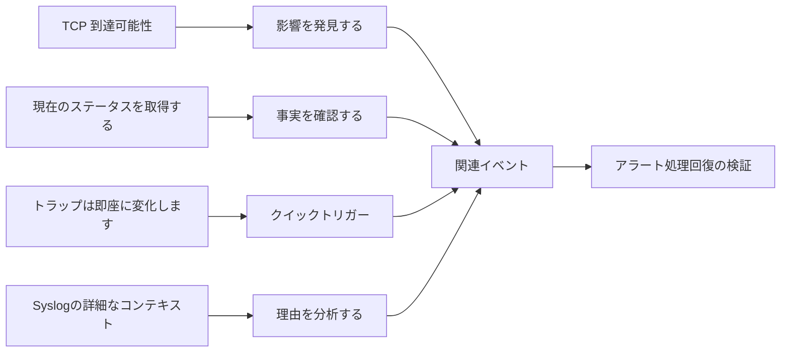

# コースの概要と考察

4 つの質問からモニタリングのクローズド ループに戻り、次の設計の方向性を明確にします。

## 重要ポイント

- TCP Ping はポートがアクセス可能かどうかを確認できますが、アプリケーションと業務の正常性を証明するものではありません。
- SNMP GET は、ポーリング サイクルとデバイス オブジェクトによって制限される現在のステータスと傾向を確認します。
- SNMP Trap は、発生したばかりで、損失、嵐、不十分なコンテキストから保護する必要がある変更を報告します。
- Syslog はイベントと考えられる原因を説明し、統一された時間、解析、安全な送信を必要とします。
- 次のステップは、キャパシティ プランニング、イベント相関関係、アラート ノイズの低減、エンドツーエンドの業務検出について検討することです。

---

## 章末クイズ

この章には5問の四択問題があります。

### 第 1 問

コース概要では、現状と傾向を特定するのにどの方法が使用されますか?

- A. TCP Ping
- B. SNMP GET
- C. SNMP Trap
- D. Syslog

回答を選んだ後に解答を開く

正解：B. SNMP GET

解説：GET サイクルは、現在のステータス、過去の傾向、およびしきい値の判断のために構造化オブジェクトを読み取ります。

### 第 2 問

例外から回復までの完全な閉ループとは何ですか?

- A. トラップを1つだけ受信したら終了
- B. ログを処理せずに保存のみする
- C. ポート成功後にすべての履歴を削除する
- D. 影響の発見、状況の確認、原因の分析、対処と再検証

回答を選んだ後に解答を開く

正解：D. 影響の発見、状況の確認、原因の分析、対処と再検証

解説：閉じた監視ループは、障害を検出するだけでなく、回復の特定、説明、処理、検証も行います。

### 第 3 問

詳細なイベント コンテキストを提供するには、4 つの方法のうちどれが最も適していますか?

- A. Syslog
- B. TCP Ping
- C. SNMP GET
- D. SNMP Trap

回答を選んだ後に解答を開く

正解：A. Syslog

解説：Syslog にはイベント テキスト、時刻、原因の手掛かりが含まれることが多く、診断や監査に適しています。

### 第 4 問

モニタリングを実際のユーザーエクスペリエンスに近づけたい場合、次に何を追加する必要がありますか?

- A. トラップメールの数だけを増やす
- B. すべてのステータスの収集を停止する
- C. プロトコル、アプリケーション、エンドツーエンドの業務トランザクションの検出
- D. すべてのポート結果を正常に変更する

回答を選んだ後に解答を開く

正解：C. プロトコル、アプリケーション、エンドツーエンドの業務トランザクションの検出

解説：ユーザー業務の成功を証明するには、4つの基本的な手法だけではまだ不十分であり、より高いレベルのリアルなインタラクションチェックが必要です。

### 第 5 問

総合的な理解として正しいのはどれか?

- A. どちらの方法でも他の方法を完全に置き換えることができます
- B. 4 種類の証拠にはそれぞれ独自の境界があり、相関をとった後にのみ、より信頼性の高い判断を下すことができます。
- C. メッセージがないなら必ず正常である
- D. ポートの成功はすべてのサービスの成功と同じです

回答を選んだ後に解答を開く

正解：B. 4 種類の証拠にはそれぞれ独自の境界があり、相関をとった後にのみ、より信頼性の高い判断を下すことができます。

解説：このコースの核心は、各信号の範囲を尊重し、検出から相関関係による回復までの閉ループを構築することです。

<!-- QUIZ_DATA_START
{
  "chapter": "28",
  "questions": [
    {
      "id": 1,
      "question": "コース概要では、現状と傾向を特定するのにどの方法が使用されますか?",
      "options": {
        "A": "TCP Ping",
        "B": "SNMP GET",
        "C": "SNMP Trap",
        "D": "Syslog"
      },
      "answer": "B",
      "explanation": "GET サイクルは、現在のステータス、過去の傾向、およびしきい値の判断のために構造化オブジェクトを読み取ります。"
    },
    {
      "id": 2,
      "question": "例外から回復までの完全な閉ループとは何ですか?",
      "options": {
        "A": "トラップを1つだけ受信したら終了",
        "B": "ログを処理せずに保存のみする",
        "C": "ポート成功後にすべての履歴を削除する",
        "D": "影響の発見、状況の確認、原因の分析、対処と再検証"
      },
      "answer": "D",
      "explanation": "閉じた監視ループは、障害を検出するだけでなく、回復の特定、説明、処理、検証も行います。"
    },
    {
      "id": 3,
      "question": "詳細なイベント コンテキストを提供するには、4 つの方法のうちどれが最も適していますか?",
      "options": {
        "A": "Syslog",
        "B": "TCP Ping",
        "C": "SNMP GET",
        "D": "SNMP Trap"
      },
      "answer": "A",
      "explanation": "Syslog にはイベント テキスト、時刻、原因の手掛かりが含まれることが多く、診断や監査に適しています。"
    },
    {
      "id": 4,
      "question": "モニタリングを実際のユーザーエクスペリエンスに近づけたい場合、次に何を追加する必要がありますか?",
      "options": {
        "A": "トラップメールの数だけを増やす",
        "B": "すべてのステータスの収集を停止する",
        "C": "プロトコル、アプリケーション、エンドツーエンドの業務トランザクションの検出",
        "D": "すべてのポート結果を正常に変更する"
      },
      "answer": "C",
      "explanation": "ユーザー業務の成功を証明するには、4つの基本的な手法だけではまだ不十分であり、より高いレベルのリアルなインタラクションチェックが必要です。"
    },
    {
      "id": 5,
      "question": "総合的な理解として正しいのはどれか?",
      "options": {
        "A": "どちらの方法でも他の方法を完全に置き換えることができます",
        "B": "4 種類の証拠にはそれぞれ独自の境界があり、相関をとった後にのみ、より信頼性の高い判断を下すことができます。",
        "C": "メッセージがないなら必ず正常である",
        "D": "ポートの成功はすべてのサービスの成功と同じです"
      },
      "answer": "B",
      "explanation": "このコースの核心は、各信号の範囲を尊重し、検出から相関関係による回復までの閉ループを構築することです。"
    }
  ]
}
QUIZ_DATA_END -->
