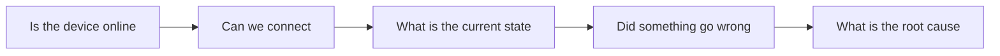

# Why We Need Four Monitoring Methods

In short: no single monitoring method can answer every question about a device's state.

## Key Points

* TCP Ping answers "can we connect"
* SNMP GET answers "what is the state right now"
* SNMP Trap answers "what just happened"
* Syslog answers "why did it happen"
* Together these four methods form a complete monitoring pipeline
