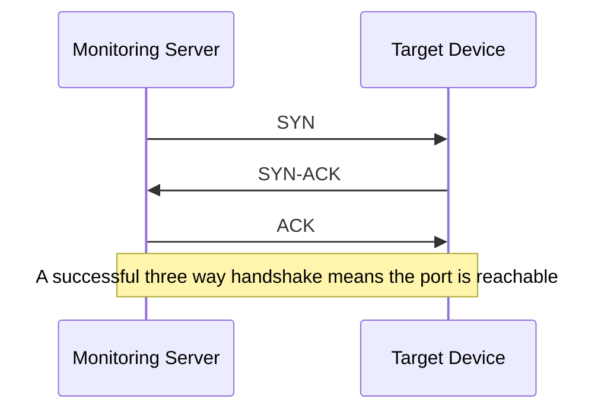

# TCP Ping: Checking Port Connectivity

In short: TCP Ping determines whether a specific port is reachable by attempting to establish a TCP connection.

## Key Points

* It checks a specific port, not the whole host
* Commonly used to check ports like 80, 443, 22, 3306
* Unlike ICMP Ping, ICMP checks reachability at the network layer
* A firewall may block ICMP while still allowing a specific port
* Good for quickly confirming that a service is listening
