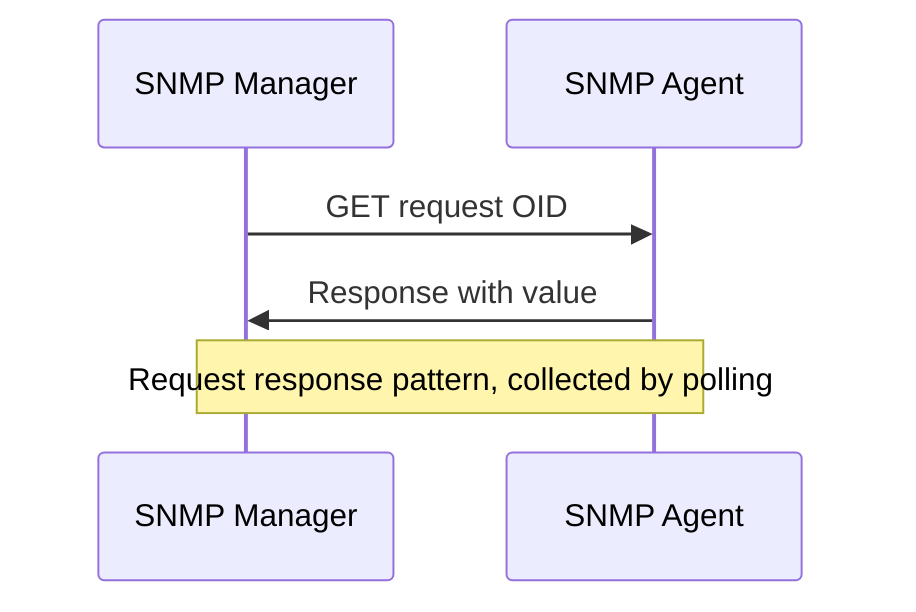

# SNMP GET: Actively Querying Device State

In short: the monitoring server actively queries a device for specific metrics using an OID.

## Key Points

* Uses UDP port 161
* Uses an OID to identify a specific metric
* Can query CPU, memory, interface traffic, uptime, and more
* SNMPv3 supports authentication and encryption, better suited for production
* This is a polling model, so a reasonable collection interval must be set
