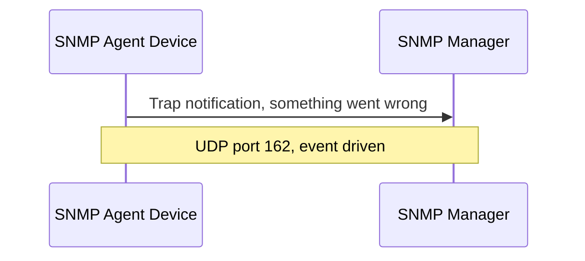

# SNMP Trap: The Device Reports Problems Proactively

In short: when a device detects a problem, it notifies the monitoring server right away, without waiting for the next poll.

## Key Points

* Uses UDP port 162
* Sent proactively by the device, no prior request from the server needed
* Common events include interface down, power failure, overheating, device restart
* Traditional traps have no acknowledgment mechanism and can be lost
* Inform is a notification type with acknowledgment, which is more reliable
