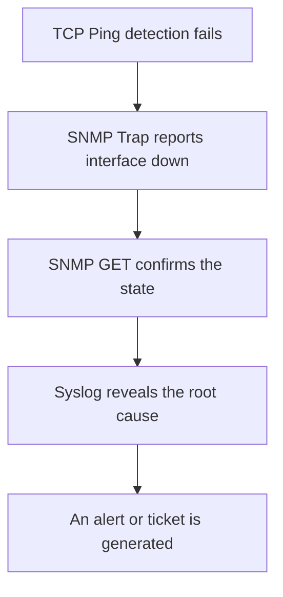

# A Combined Scenario: Diagnosing a Router Interface Failure

In short: all four monitoring methods work together to fully reconstruct the process of diagnosing an interface failure.

## Key Points

* Step 1: TCP Ping detects that the SSH port connection times out
* Step 2: SNMP Trap reports an interface down event
* Step 3: SNMP GET confirms the interface's current state and traffic
* Step 4: Syslog shows the cause was a loss of signal
* Only by combining all four steps can you reach a complete conclusion
