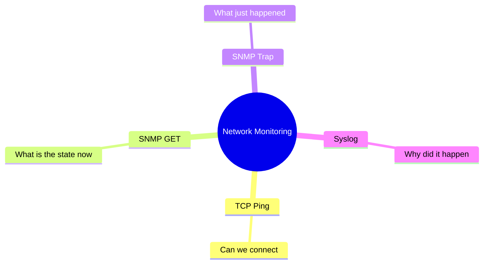

# Summary and Further Thoughts

In short: each of the four methods answers one question, and together they form a complete monitoring system.

## Key Points

* TCP Ping determines connectivity
* SNMP GET collects state metrics
* SNMP Trap quickly surfaces problems
* Syslog provides the detailed root cause
* The four methods divide the work, they don't replace each other
